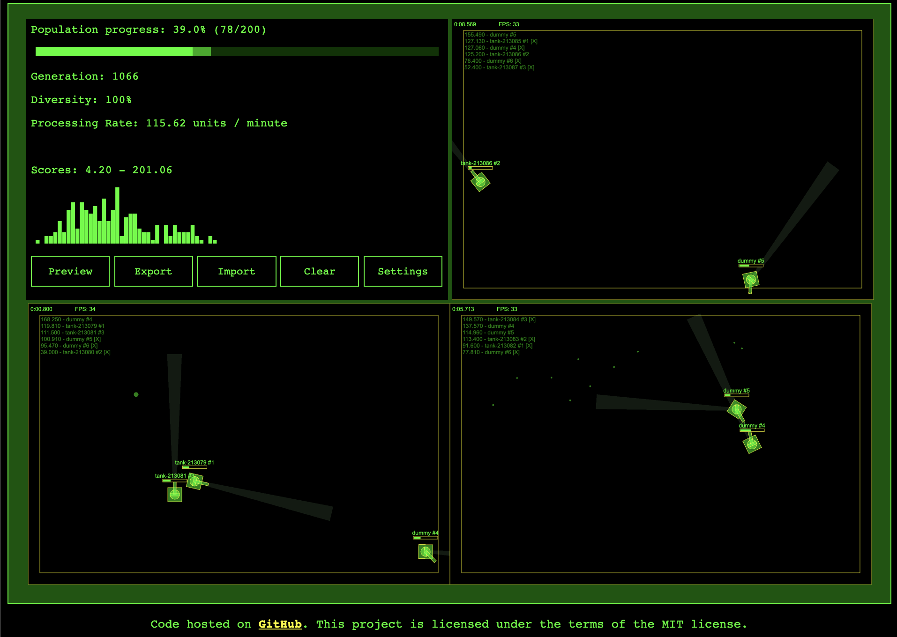
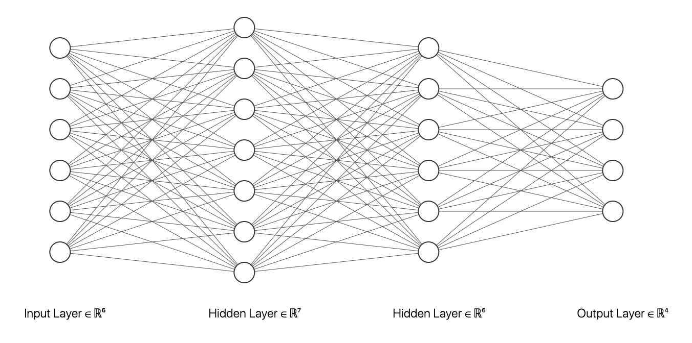

# kaboom
The project is about evolving a [neural network](https://en.wikipedia.org/wiki/Neural_network) that successfully controls a tank and fights in [JsBattle](https://jsbattle.jmrlab.com) coding game.

## Neural Network

### Inputs
- **wallDistance** - distance to the nearest wall in radar range. The value is in range of `-1` to `1`. The input is set to `1` if there is no wall in radar range.
- **enemyDistance** - distance to the nearest enemy in radar range. The value is in range of `-1` to `1`. The input is set to `1` if there is no enemy in radar range.
- **enemyAngle** - how far away the enemy is from the center of radar beam. `-1` represents the left edge, `0` is the center and `-1` is the right edge.
- **collision** - determine whether the tank hit an obstacle recently. `1` means recent collision and `0` is opposite
- **boost** - the amount of boost left (a number between `-1` and `1`)
- **targetting alarm** - determine whether the tank is in radar beam of an enemy (`0` or `1`)

### Output
- **throttle** - throttle controls. Negative numbers result in backward movement while positive values move the tank forward
- **turn** - the speed of turning
- **shoot** - determine whether to shot or not.
- **shoot** - determine whether to boost or not.

### Network Structure:
- Six inputs
- Two hidden layers (7 and 6 nodes)
- Four outputs

## Evolution
The neural network is evolved by a [genetic algorithm](https://en.wikipedia.org/wiki/Genetic_algorithm). The Fitness formula is based on the score achieved during the battle. Rendering could be disabled to speed up evolution. Each step of the simulation is saved in Local Storage so simulation could be stopped and continued later

## Installation
1. Download sources from GitHub
2. Install all dependencies by executing `npm i` in the project folder
3. Run `npm start` and visit [http://localhost:9000](http://localhost:9000)

# Import population
Evolving neural network takes time. There is a snapshot of 1000th generation for the impatient. Download the [kaboom-gen1000-size200.json](kaboom-gen1000-size200.json) file and import it to skip 1K of generation steps.
